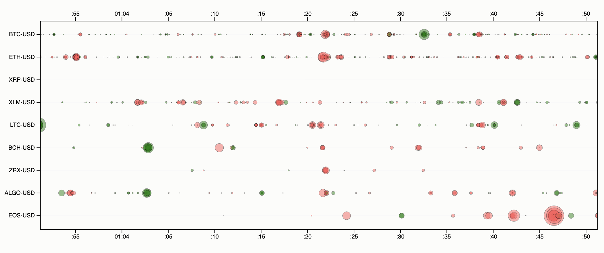

# crypto-trades
Visualize crypto currency trades in real time. See live demo [here](https://rhammell.github.io/crypto-trades/).

Trades information is provided by the Coinbase Pro [websocket feed](https://docs.pro.coinbase.com/#websocket-feed). Each trade is represented as a circle on a scrolling timeline, with new trades flowing in from the right.  

  

  

